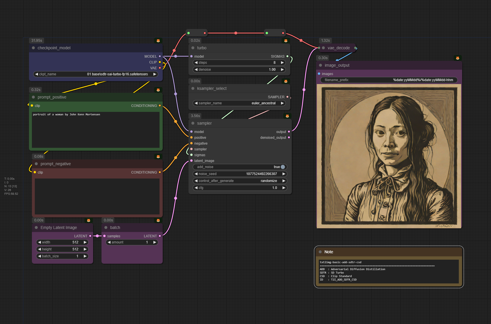

42 workflows 

## File
Each worklow is name 
[Category]-[Workflow]-[Method]-[Model]-[Clip]

## Category
Num | ID | Name | Output File ID |
--- | --- | --- | --- |
001 | txt2img | Text to Image | T2I |
002 | img2img | Image to Image | I2I |
003 | inpaint | Image Inpaint | IIP |
004 | outpaint | Image Outpaint | IOP |
011 | upscale | Image Upscale | IUS |
030 | face2img | Face to Image | F2I |
031 | faceswap | Face swap | FSW |
032 | couple | Couple Face | CPL |

## Workflows
Num | Catagory | Workflow | Output File ID | Description |
--- | --- | --- |  --- |   --- |
00100 | Text to Image | txt2img | T2I | Create an image using prompts |
00200 | Image to Image | img2img-basic | I2I | Create an image using another image |
00201 | Image to Image | img2img-cn | I2I-CN | Create an image using constraint from another image|
00210 | Image to Image | img2img-wdtagger | I2I-WDT | Create an image using auto tag from another |
00300 | Image Inpaint | img2img-inpaint | INP | Change part of image using mask and prompt |
03000 | Face to Image | face2img-instantid | | |
03010 | Face to Image | face2img-ipadapter faceid | | |
03100 | Face Swap | faceswap-ipadapter faceid lora  | | |

## Method
Each workflow can use several methods according to the model used

ID | Name | Paper |Image|
--- | --- | --- | --- |
ADD | Adversarial Diffusion Distillation | [Adversarial Diffusion Distillation](https://arxiv.org/pdf/2311.17042) ||
LDM | Large Diffusion Model | [High-Resolution Image Synthesis with Latent Diffusion Models](https://arxiv.org/abs/2112.10752) ||
LCM | Latent Consistency Model | [LCM-LoRA: A Universal Stable-Diffusion Acceleration Module](https://arxiv.org/abs/2311.05556) ||
MDT | Multimodal Diffusion Transformer | [Scaling Rectified Flow Transformers for High-Resolution Image Synthesis](https://arxiv.org/pdf/2403.03206) ||
WSN | | --- ||

## Model
Each workflow is made for a special model class listed below

ID | Link |
--- | --- |
SD15 | [Stable Diffusion 1.5](https://huggingface.co/runwayml/stable-diffusion-v1-5) |
SDXL | [Stable Diffusion XL](https://stability.ai/news/stability-ai-sdxl-turbo) |
SD30 | [Stable Diffusion 3.0](https://stability.ai/news/stable-diffusion-3-medium)|
SDCA | Stable Diffusion Cascade |

## Clip
ID | Name |
--- | --- |
CLSD | Clip Standard |
CLXL | Clip XL |
